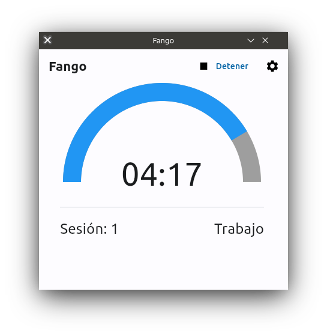

# Fango
Fango is a Pomodoro app made with Python3



## Features
- Toolkit agnostic
- UI written in Flet
- Desktop notifications

## How to use
Fango isn't packaged into an executable app yet, but you can still run it in your computer,
you will need to have Python 3 installed as the first requirement. Before installing anything
else I recommend you to use a virtual environment for this. Just run:

```bash
python3 -m venv "name_for_the_environment"
cd "name_for_the_environment"
source bin/activate
```

Install the dependencies for Fango:

```bash
pip3 install -r requirements.txt
```

Now you're able to run Fango, run either "ui.py" or "launch_fango.sh"

NOTE: launch_fango is intended to activate for you your virtual environment,
provide the path to the activate script of it before using it.

## Dependencies
- python3
- desktop-notifier >= 3.5.6
- flet >= 0.22.0