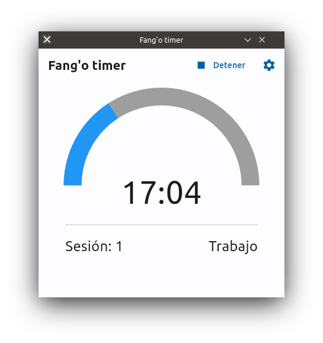

# Fango
Fango is a Pomodoro app made with Python3

<p align="center">
    
</p>

## Features
- Toolkit agnostic
- UI written in Flet
- Desktop notifications
- Bilingual support

## How to use
Fang'o can be run it in your computer no matter if you have Windows or Linux,
you will need to have Python 3 installed as the first requirement. Before installing anything
else I recommend you to use a virtual environment for this. Just run:

```bash
python3 -m venv "name_for_the_environment"
cd "name_for_the_environment"
source bin/activate
```

Copy the Fango repository files to the virtual environment and install the dependencies for Fango
from its folder:

```bash
pip3 install -r requirements.txt
```

Now you're able to run Fango, run either "fang-o.py" or "launch_fango.sh"

NOTE: launch_fango is intended to activate for you your virtual environment,
provide the path to the activate script of it before using it.

## Dependencies
- python3
- dbus-python >= 1.3.2 (Only on Linux)
- plyer >= 2.1.0
- flet >= 0.22.0
- pydub >= 0.25.1

## External dependencies
- libmpv.so.1 (Linux only - Flet requirement)